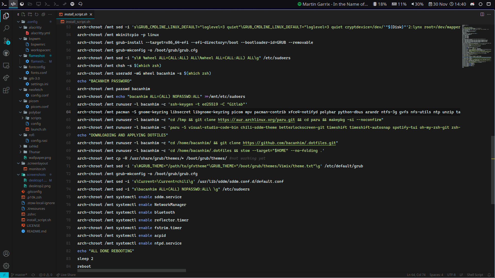

    <blockquote>
        
WIP for fedora and Hyprland

    </blockquote>

## Installation

You can use [GNU Stow](https://www.gnu.org/software/stow/) to install the
dotfiles contained in this repository. Simply `cd` into your clone of this
repository and run the following command:

`
stow --target="$HOME" --no-folding .
`

By default, GNU Stow symlinks directories that don't exist in the target
directory, but with the `--no-folding` flag, GNU Stow will _create_ those
directories in your home directory, and only symlink actual files.

## Details

### Graphical environment

<!-- - Window manager: [hyprland](https://github.com/) -->
<!-- - Bar: [waybar](https://github.com/) -->
<!-- - Notification daemon: [xfce4-notifyd](https://docs.xfce.org/apps/notifyd/start) -->
<!-- - Program launcher: [Rofi](https://github.com/davatorium/rofi) -->
<!-- - Screen locker: [betterlockscreen](https://github.com/pavanjadhaw/betterlockscreen) -->

### Fonts

- Sans-serif font: [Noto Sans](https://www.google.com/get/noto/)
- Serif font: [Noto Serif](https://www.google.com/get/noto/)
- Cascadia Code: [Cascadia Code](https://github.com/microsoft/cascadia-code)
- Monospace font: [Consolas](https://aur.archlinux.org/packages/consolas-font)
<!-- - Icon font for Polybar: [Font Awesome](https://fontawesome.com/) -->

### Command-line

- Shell: [Zsh](https://github.com/zsh-users/zsh)
- Terminal emulator: [Alacritty](https://github.com/jwilm/alacritty)
- Oh-My-Zsh: [Oh-My-Zsh](https://github.com/ohmyzsh/ohmyzsh)
- Terminal Theme: [Powerlevel10k](https://github.com/romkatv/powerlevel10k)

### Development environment

- Primary code editor: [Visual Studio Code](https://github.com/microsoft/vscode) and yes i use microsoft's one (need some plugins from store);
- Text editor for quick edit: [Vim](https://www.vim.org/)
- Java IDE: [IntelliJ IDEA Community Edition](https://github.com/JetBrains/intellij-community) or [NetBeans](https://netbeans.apache.org/)

### Miscellaneous

- Web browser: [Firefox](https://www.mozilla.org/en-US/firefox/new/)
<!-- - File manager:[Thunar](https://github.com/xfce-mirror/thunar) -->
- Video player: [mpv](https://github.com/mpv-player/mpv)
- Screenshot tool: [Flameshot](https://github.com/lupoDharkael/flameshot)
- Password Manager: [Bitwarden](https://github.com/bitwarden)
<!-- - BTRFS + timeshift with auto-snap and grub entries [Script](./install_script.sh) -->

### Theme

- GTK theme: [Materia](https://github.com/nana-4/materia-theme)
- Cursor theme: [Capitaine cursors](https://github.com/keeferrourke/capitaine-cursors)
- [Wallpaper](https://wall.alphacoders.com/big.php?i=1155716)

Inspired by: [OverMighty](https://github.com/OverMighty/dotfiles)
